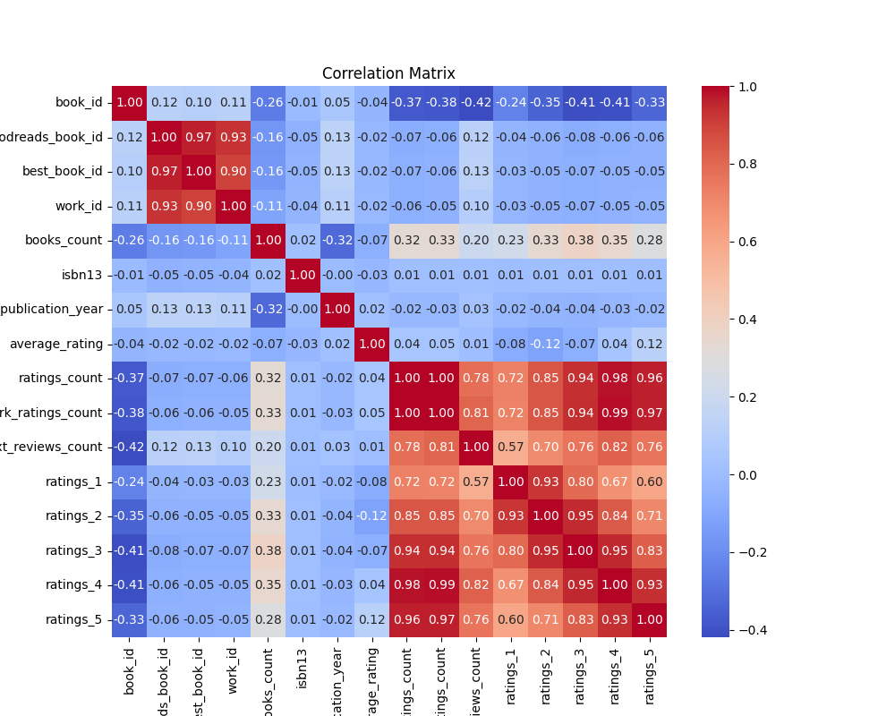
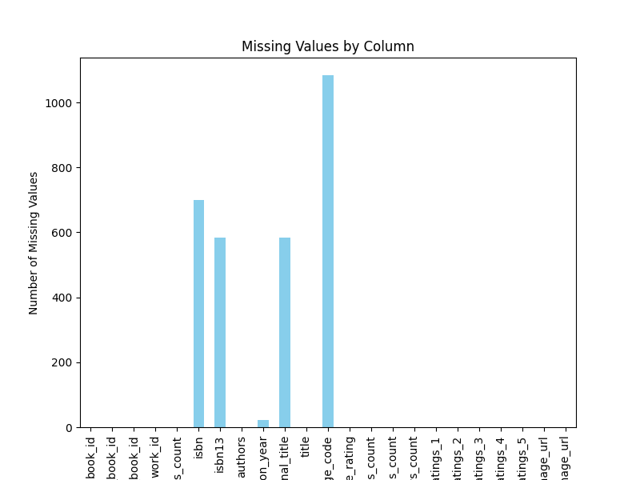

# Analysis of goodreads
## Dataset Overview
This analysis is based on the `goodreads` dataset.

## Insights
Based on the provided dataset description and summary statistics, here are some insights, significant findings, and suggestions for further analysis:

### Insights and Significant Findings:

1. **Data Overview**:
   - The dataset contains **10,000 rows** and **23 columns**, primarily focused on books, ratings, and reviews on Goodreads.
   - Key identifiers include `book_id`, `goodreads_book_id`, and `work_id`.

2. **Missing Values**:
   - There are several columns with missing values:
     - `isbn`: 700 missing entries (7% missing)
     - `isbn13`: 585 missing entries (5.85% missing)
     - `original_publication_year`: 21 missing entries
     - `original_title`: 585 missing entries
     - `language_code`: 1084 missing entries (10.84% missing)
   - Missing values might impact analyses that depend heavily on these fields, especially for ISBNs or publication years.

3. **Outlier Detection**:
   - A significant number of potential outliers were detected in various fields like `goodreads_book_id`, `best_book_id`, and `work_id`. For instance, `goodreads_book_id` had numerous outliers, which may skew results in any aggregated metrics or analyses.
   - Identifying and treating these outliers is crucial as they could represent erroneous entries or significant variations in book popularity.

4. **Ratings and Reviews**:
   - The **average rating** across books is around **4.00**, indicating a generally positive reception.
   - The total **ratings_count** shows a significantly high number (over 4.7 million) for at least one book (`ratings_count` field). Books like this could skew user experience data if not handled properly.
   - The distribution of ratings among different categories (`ratings_1` to `ratings_5`) highlights the potential concentration of positive feedback (with a significant bias towards `ratings_5`).

5. **Authors and Book Diversity**:
   - There are **4664 unique authors** in the dataset and **9964 unique titles**. 
   - The presence of multiple entries for popular authors (e.g., Stephen King) and the uniqueness of original titles suggest that the dataset captures a wide variety of literary works.

6. **Language Diversity**:
   - There are **25 unique language codes**, suggesting the dataset includes books in various languages. However, more than **10% of the entries** are missing these language codes.
   - Understanding language diversity can be crucial for markets' segmentation analyses or for specific language readers.

### Suggested Additional Analyses:

1. **Correlation Analysis**:
   - Conduct a correlation analysis between numerical features (e.g., `average_rating`, `ratings_count`, `work_ratings_count`, etc.) to understand how these fields interact. This could provide insights into how rating dynamics work.

2. **Time Series Analysis**:
   - Analyze `original_publication_year` to understand trends over time in book ratings. For instance, are newer books rated higher than older ones?

3. **Missing Value Treatment**:
   - Explore methods for imputing missing values or discarding rows with excessive missing data. Analyzing the impact of these methods on conclusions can yield an understanding of potential biases.

4. **Genre and Tagging Analysis**:
   - If available, adding genre data (books labeled under specific categories) could yield insights into which genres receive the highest ratings, helping in genre popularity analysis.

5. **User Behavior Analysis**:
   - Investigate patterns in user reviews over time—what influences ratings (e.g., the number of reviews, the year of publication)?
   - Conduct sentiment analysis on text reviews to quantify user sentiment and correlate it with numerical ratings.

6. **Market Segmentation**:
   - Once additional demographic data (e.g., age, location) about readers is available, segment the data to analyze how different demographics respond to book ratings.

7. **Plotting Distributions and Trends**:
   - Use visualizations to present the distributions of ratings, publication years, and other significant metrics to easily identify patterns and trends.

In summary, while the dataset appears robust in terms of size and categorical diversity, careful treatment of missing values, outliers, and deeper analysis into the relationships among features could substantially refine the insights drawn from it.

## Visualizations
### Correlation Matrix

### Missing Values Chart

