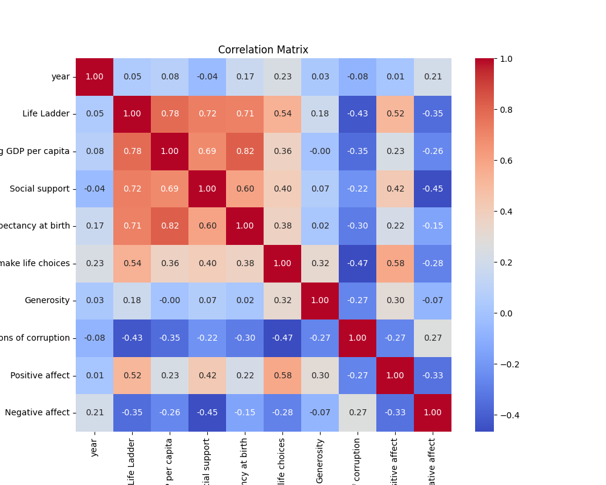
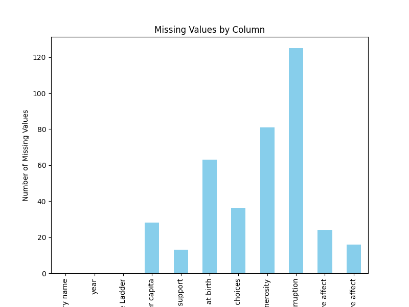

# Analysis of happiness
## Dataset Overview
This analysis is based on the `happiness` dataset.

## Insights
### Insights and Significant Findings

1. **General Statistics**:
   - **Life Ladder**: The average Life Ladder score across the dataset is approximately 5.48, suggesting a somewhat moderate perception of life satisfaction among the surveyed countries.
   - **Healthy Life Expectancy**: The average healthy life expectancy at birth is around 63.4 years. Notably, this variable has a standard deviation of 6.84 years, indicating significant variability among countries.

2. **Missing Data**:
   - Several columns exhibit missing values, particularly:
     - `Healthy life expectancy at birth`: 63 missing entries, meaning that data is available for only about 97% of the dataset.
     - `Generosity`: 81 missing entries (approximately 3.43%).
     - `Perceptions of corruption`: 125 missing entries, which is the most substantial number of missing values indicating potential data unavailability for certain countries or years.
   - These missing values may impact analyses, suggesting a need for imputation or consideration of their absence in any modeling approaches.

3. **Outliers**:
   - There are multiple outliers detected in columns such as `Life Ladder`, `Healthy life expectancy`, `Social support`, `Freedom to make life choices`, and `Generosity`. For example:
     - `Healthy life expectancy` shows extreme low values such as 6.72 years, indicating potential data collection or reporting issues in specific regions.
     - Outlier analysis is crucial as these values can skew the results of statistical analyses and hypothesis testing.

4. **Yearly Data Distribution**:
   - Data spans from 2005 to 2023, with an average year around 2015, suggesting a more substantial volume of data in the 2010s. 
   - Investigating temporal trends could provide insights into how measures of well-being, economic factors, and societal perceptions have evolved over time.

### Additional Analyses Suggested

1. **Time Series Analysis**:
   - Examine trends over time for various variables such as `Life Ladder`, `Log GDP per capita`, and `Healthy life expectancy`. This can reveal how these factors have changed between 2005 and 2023, potentially linked to major global events or trends (e.g., economic crises, health crises such as the COVID-19 pandemic).

2. **Correlation and Multivariate Analysis**:
   - Conduct correlation analyses to identify relationships between variables. For example, check the correlation between `Log GDP per capita` and `Life Ladder`, or between `Generosity` and `Freedom to make life choices`. 
   - Perform regression analyses to determine the influence of economic and social support factors on overall happiness (Life Ladder).

3. **Country Comparison**:
   - Compare country-level averages across key metrics. This could involve visualizations such as box plots or heat maps to identify regions that perform better or worse relative to each other.
   - It would also be insightful to explore common characteristics among countries with the highest and lowest Life Ladder scores.

4. **Handling Missing Data**:
   - Develop a strategy for handling missing data. Consider using techniques such as mean/mode imputation for numerical data or applying more complex techniques like K-nearest neighbors or multiple imputation to minimize the biases introduced by missing data.

5. **Segmentation Analysis**:
   - Group countries based on certain thresholds of `Life Ladder`, `Healthy life expectancy`, or the socioeconomic metrics to see if there are distinct patterns or segments that could benefit from targeted interventions.

6. **Sentiment Analysis**:
   - If the dataset can be supplemented with qualitative data (e.g., survey responses, social media sentiment around different countries), conducting a sentiment analysis might add depth to the quantitative findings.

### Conclusion

The dataset presents a rich opportunity for analysis with its comprehensive metrics on life satisfaction and global development indicators. By applying the suggested analyses, one can gain a deeper understanding of the interconnectedness of health, economy, and overall life quality across different countries, potentially informing policy recommendations or interventions aimed at improving societal well-being.

## Visualizations
### Correlation Matrix

### Missing Values Chart

