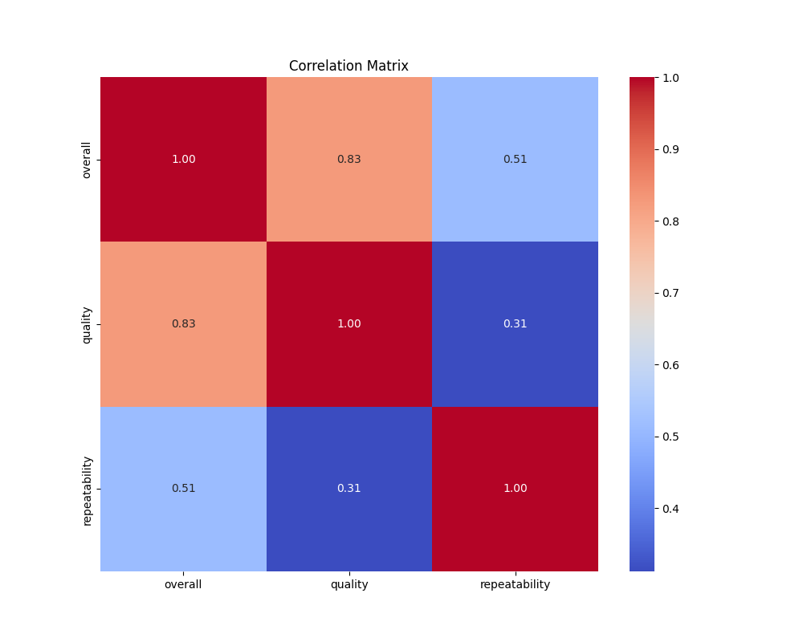
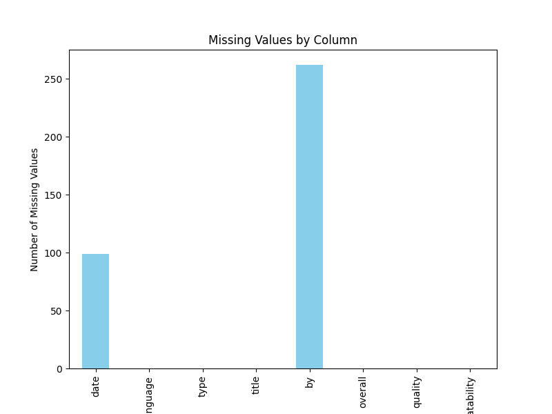

# Analysis of media
## Dataset Overview
This analysis is based on the `media` dataset.

## Insights
### Insights and Significant Findings

1. **Data Overview**:
   - The dataset contains a total of **2652 rows** and **8 columns**, with several categorical and numerical variables.
   - The **date** range appears to have a significant number of unique entries (2055) indicating a variety of dates represented, though there are **99 missing dates**.

2. **Missing Values**:
   - The 'by' column has **262 missing values** (approximately 10% of the total rows). Handling this missing data is crucial, especially if 'by' is significant for analyses or modeling.
   - There are no missing values in the 'language', 'type', 'title', 'overall', 'quality', and 'repeatability' columns, indicating these data points are complete.

3. **Categorical Variables**:
   - The **"language"** column suggests a predominance of English, with **1306 occurrences**.
   - The **“type”** column has a high frequency of specific types, with **movie** being the most frequent (2211 occurrences). Exploring other types could provide insights into trends or preferences.

4. **Numerical Variables**:
   - For **overall** ratings:
     - **Mean**: ~3.05, indicating a generally favorable review.
     - **Standard Deviation**: ~0.76 suggests moderate variability in reviews.
     - The range of scores from **1 to 5** indicates a structured scoring system.
   - For **quality** ratings:
     - **Mean**: ~3.21, indicating a similar trend to overall ratings.
     - **Standard Deviation**: ~0.80, signifying variability in quality perceptions.
   - The **repeatability** ratings have a mean of approximately **1.49**, which suggests that repeat views or revisitation is less common.

5. **Outlier Detection**:
   - Significant outliers exist in the **"overall"** and **"quality"** ratings. The presence of multiple occurrences of maximum (5) and minimum (1) values indicates polarized opinions in the dataset.
   - The **"quality"** column has multiple occurrences of **1,**, indicating potentially unsatisfactory items that might skew analysis.

### Suggestions for Additional Analyses

1. **Handling Missing Values**:
   - Consider imputation techniques for the 'by' column or implement a separate value for unknown 'by' entries. Evaluate the potential impact of these adjustments on the analysis.

2. **Trend Analysis**:
   - Analyze trends over time based on the **date** column to observe how ratings might fluctuate. Group by year, month, or day of the week to uncover insights.

3. **Correlation Analysis**:
   - Examine correlations between **overall**, **quality**, and **repeatability** ratings. A specific focus on the relationship between the overall experience and repeatability can inform strategies to improve engagement.

4. **Comparative Analysis**:
   - Perform a comparative analysis of ratings based on **language** and **type**. This may uncover whether certain languages/types receive consistently higher or lower ratings.
   - Additionally, explore if there are differences in ratings between first-time viewers versus repeat users.
   
5. **Sentiment Analysis**:
   - If available, analyze textual feedback associated with the ratings (titles, by, etc.). This may provide qualitative insights that enhance understanding of the quantitative findings.

6. **Visualizations**:
   - Use visualizations (like histograms, box plots, and heatmaps) to communicate findings regarding distributions of ratings, relationships, and missing data effectively.

By conducting these analyses and exploring these areas further, you can extract richer insights, enhance understanding of the dataset, and potentially improve associated metrics in whatever context it is being used.

## Visualizations
### Correlation Matrix

### Missing Values Chart

